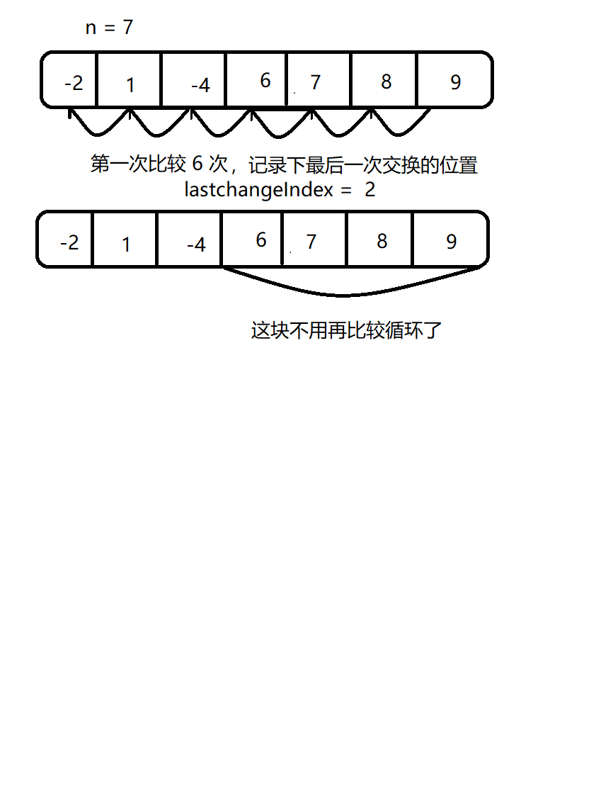

# <center>29.ndk调试、冒泡优化、插入和希尔排序<center>
@[TOC](数据结构和算法)

具体代码请看：**[NDKPractice项目的datastructure28bubbkeselectsort](https://github.com/EastUp/NDKPractice/tree/master/datastructure28bubbkeselectsort)**

# 知识点：

## 1. ndk的调试：

两种方法：

###  1.1 `ndk-stack` 调试

条件：配置 `adb` 和 `ndk` 的环境变量.  
命令：`adb logcat | ndk-stack -sym E:\AndroidStudioProjects\MyBintrayLib\NDKPractice\datastructure28bubbkeselectsort\build\intermediates\cmake\debu
g\obj\arm64-v8a` // 路径为有.so库的路径

### 1.2 `addr2line`
条件：配置addr2line的环境变量：  
`D:\AndroidSdk\ndk\21.2.6472646\toolchains\aarch64-linux-android-4.9\prebuilt\windows-x86_64\bin`

命令：  
`aarch64-linux-android-addr2line -e E:\AndroidStudioProjects\MyBintrayLib\NDKPractice\datastructure28bubbkeselectsort\build\intermediates\cmake\debu
g\obj\arm64-v8a\libnative-lib.so 000000000000fdb8 // 000000000000fdb8是(详细错误)
`

命令最后一位的地址编码请看：
```c++
2020-07-02 16:38:57.553 18029-18029/? A/DEBUG: backtrace:
2020-07-02 16:38:57.554 18029-18029/? A/DEBUG:     #00 pc 000000000006a784  /system/lib64/libc.so (tgkill+8)
2020-07-02 16:38:57.554 18029-18029/? A/DEBUG:     #01 pc 000000000001db50  /system/lib64/libc.so (abort+88)
2020-07-02 16:38:57.554 18029-18029/? A/DEBUG:     #02 pc 000000000002532c  /system/lib64/libc.so (__libc_fatal+116)
2020-07-02 16:38:57.554 18029-18029/? A/DEBUG:     #03 pc 0000000000091c6c  /system/lib64/libc.so (ifree+812)
2020-07-02 16:38:57.554 18029-18029/? A/DEBUG:     #04 pc 0000000000091eec  /system/lib64/libc.so (je_free+120)
// 主要是以下这行，复制他的地址编码到命令中
2020-07-02 16:38:57.554 18029-18029/? A/DEBUG:     #05 pc 000000000000fdb8  /data/app/com.east.datastructure28bubbkeselectsort-Rq_huZaLg_y9lQEFGFjFuw==/lib/arm64/libnative-lib.so (Java_com_east_datastructure28bubbkeselectsort_MainActivity_stringFromJNI+192)
2020-07-02 16:38:57.554 18029-18029/? A/DEBUG:     #06 pc 000000000000f09c  /data/app/com.east.datastructure28bubbkeselectsort-Rq_huZaLg_y9lQEFGFjFuw==/oat/arm64/base.odex (offset 0xf000)

```

坑: `如果addr2line的时候，报错 File format not recognized`

解决:  
　　1. <font color=red>addr2line的环境变量修改为 arm-linux-androideabi-4.9的：</font>`D:\AndroidSdk\ndk\21.2.6472646\toolchains\arm-linux-androideabi-4.9\prebuilt\windows-x86_64\bin`

　　2. 命令修改为：`arm-linux-androideabi-addr2line -e E:\AndroidStudioProjects\MyBintrayLib\NDKPractice\datastructure28bubbkeselectsort\build\intermediates\cmake\debu
g\obj\arm64-v8a\libnative-lib.so 000000000000fdb8 // 000000000000fdb8是(详细错误)`

## 2. 冒泡排序优化

思维：


特点：`适用于数组中大部分是排好序的数组`,如果大部分都没排好序，那么花费的时间比原来的冒泡排序还多

```c++
// 冒泡排序的优化（适用于数组中大部分是排好序的数组）
void optimizeBubbleSort(int arr[], int len){
    // 记录上一次最后遍历的位置
    int n = len;
    int lastchangeIndex = 0; //  最后交换的位置，控制位置
    do{
        lastchangeIndex = 0;
        for (int i = 1; i < n; ++i) {
            if(arr[i-1] > arr[i]){ // 后一个跟前一个对比
                swap(arr[i-1],arr[i]);
                // 记录交换的位置，
                lastchangeIndex = i;
            }
        }
        n = lastchangeIndex; // 记录最后一次交换的位置，证明了后面的不用交换，顺序是对的，可以避免下次循环的判断
    }while (n > 1);
}
```


