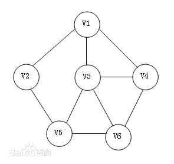
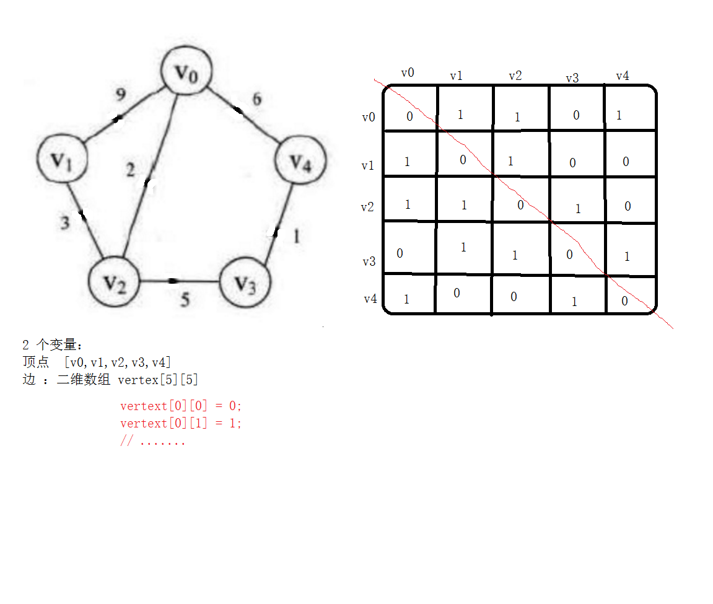
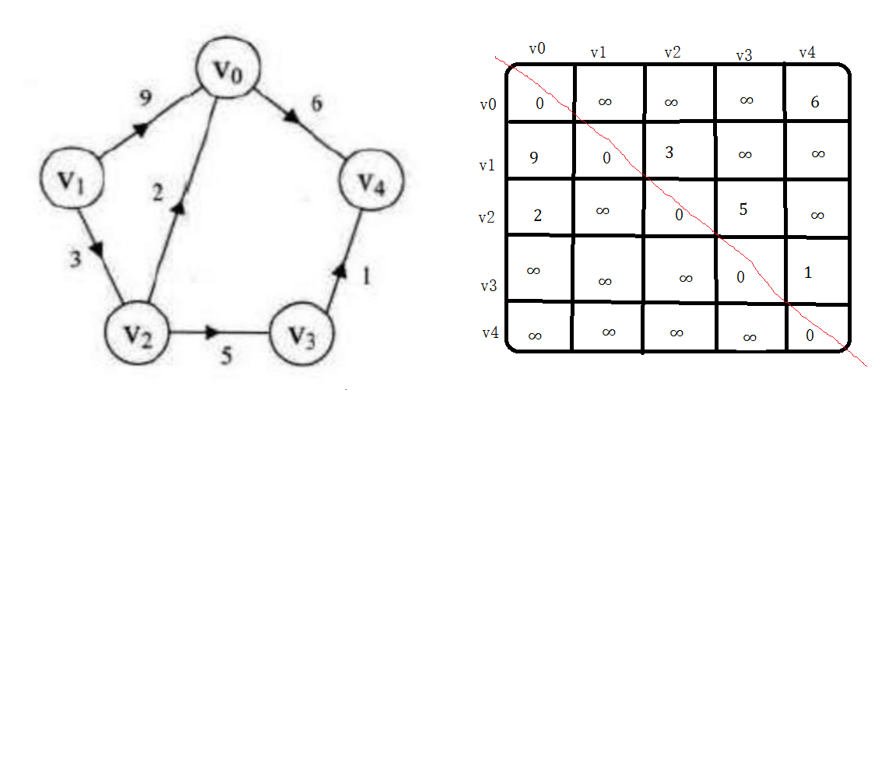

# 
43.图

@[TOC](数据结构和算法)

具体代码请看：**[NDKPractice项目的datastructure43graph](https://github.com/EastUp/NDKPractice/tree/master/datastructure43graph)**

# 知识点：

## 1. 图的基本概念：

图（Graph）是由顶点的有穷非空集合和顶点之间边的集合组成，通常表示为：G（V，E），其中，G表示一个图，V是图G中顶点的集合，E是图G中边的集合。

图就是由 点 和 边组成。

`注意：线性表中可以没有元素，称为空表。树中可以没有结点，叫做空树。但是在图中不允许没有顶点，可以没有边。`

## 2. 基本术语：
- 无向边：若顶点V1和V2之间的边没有方向，称这条边为无向边（Edge），用（V1，V2）来表示。

- 无向图（Undirected graphs）：图中任意两个顶点的边都是无向边。

- 有向边：若从顶点V1到V2的边有方向，称这条边为有向边，也称为弧（Arc），用<V2, V1>来表示，其中V1称为弧尾（Tail），V2称为弧头（Head）。

- 有向图（Directed graphs）：图中任意两个顶点的边都是有向边。

- 无向完全图：无向图中，任意两个顶点之间都存在边。

- 有向完全图：有向图中，任意两个顶点之间都存在方向相反的两条弧。

- 稀疏图；有很少条边或弧的图称为稀疏图 n*log(n)，反之称为稠密图。  相对的概念  （头发稀疏） 完全图肯定是稠密

- 权（Weight）：表示从图中一个顶点到另一个顶点的距离或耗费。

- 网：带有权重的图

- 度：与特定顶点相连接的边数；

- 出度、入度：有向图中的概念，出度表示以此顶点为起点的边的数目，入度表示以此顶点为终点的边的数目；

- 连通图：任意两个顶点都相互连通的图；

- 生成树：n个顶点，n-1条边 ，的图可以看成树 （生成树）

- 最小生成树：此生成树的边的权重之和是所有生成树中最小的；

## 3. 图的存储结构

无向边存储图如下：  

有向边存储图如下：  

