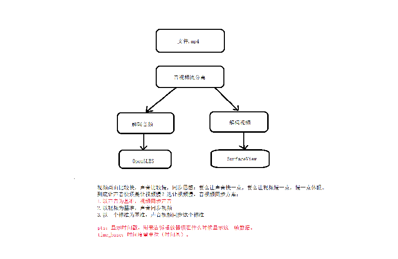

# <center>87.FFmpeg-视频播放器2<center>

具体代码请看：**[NDKPractice项目的ffmpeg87](https://github.com/EastUp/NDKPractice/tree/master/ffmpeg86)**

# 知识点：

## 1.调整音乐播放器项目架构

解码的流程 Video 和 Audio 很多相同的，所以抽离出来了公共类: Media.cpp

音频和视频单独处理成：Audio.cpp 和 Video.cpp，都继承自Media,cpp

遇到的问题：<font color = red>下面这个方法的env 不能使用 pJniCall->jniEnv</font>

```c++
void Video::setSurface(JNIEnv *env, jobject surface) {
    // 这里不能使用pJniCall->jniEnv->的env，因为和native方法传递过来的不一样，而且不相等
    /**
     *  注释的这行代码会报错
     *   'JNI DETECTED ERROR IN APPLICATION: invalid address...,thread Thread[21,tid=25717,Native,Thread*=0xc2e4a000,peer=0x12e40000,"Thread-3"] using JNIEnv* from thread Thread[1,tid=25650,Runnable,Thread*=0xf1b71e00,peer=0x757719a0,"main"]
     */
//    this->surface = pJniCall->jniEnv->NewGlobalRef(surface);
    this->videoJNIEnv = env;
    this->surface = env->NewGlobalRef(surface);
}
```

## 2. 视音频的同步



- pts：显示时间戳，用来告诉播放器该在什么时候显示这一帧数据。单位是不确定，所以使用时间基来获取单位
- time_base：时间度量单位（时间基）。

有三种办法：

1. 参考一个外部时钟，将音频与视频同步至此时间。
2. 以视频为基准，音频去同步视频的时间。
3. 以音频为基准，视频去同步音频的时间。

`由于某些生物学的原理，人对声音的变化比较敏感，但是对视觉变化不太敏感。所以采用方案 3 `

- `static inline double av_q2d(AVRational a)`：使用时间基获取单位
- `timeBase = pFormatContext->streams[streamIndex]->time_base;`：获取时间基
- `duration = pFormatContext->duration;`：获取音视频时长（`单位微秒`）
- `double times = av_frame_get_best_effort_timestamp(pFrame) * av_q2d(timeBase);`: 获取当前时间
- `double times = pPacket->pts * av_q2d(timeBase);`: 获取当前时间
- `av_usleep(frameSleepTime * 1000000);`：休眠（`单位毫秒`）


```c++
 // 播放之前判断一下要休眠多久
double frameSleepTime = pVideo->getFrameSleepTime(pPacket,pFrame); // 这是秒
av_usleep(frameSleepTime * 1000000);// 这是毫秒

double Video::getFrameSleepTime(AVPacket *pPacket,AVFrame *pFrame) {
    // 这两种方法都能算出当前显示帧的时间
//    double times = av_frame_get_best_effort_timestamp(pFrame) * av_q2d(timeBase);
    double times = pPacket->pts * av_q2d(timeBase);
    if (times > currentTime) {
        currentTime = times;
    }
    // 相差多少秒
    double diffTime = pAudio->currentTime - currentTime; // 负数，音频比视频慢

    // 视频快了就慢点，视频慢了就快点
    // 但是尽量把事件控制在视频的帧率时间范围左右  1/24 0.04 1/30 0.033

    // 第一次控制 0.016s 到 -0.016s
    if (diffTime > 0.016 || diffTime < -0.016) {
        if (diffTime > 0.016) {
            delayTime = delayTime * 2 / 3;
        } else if (diffTime < -0.016) {
            delayTime = delayTime * 3 / 2;
        }
        // 第二次控制 defaultDelayTIme * 2 / 3 到 defaultDelayTime * 3 / 2
        if (delayTime < defaultDelayTime / 2) {
            delayTime = defaultDelayTime * 2 / 3;
        } else if (delayTime > defaultDelayTime * 2) {
            delayTime = defaultDelayTime * 3 / 2;
        }
    }

    // 第三次控制，这基本是异常情况
    if (diffTime >= 0.25)
        delayTime = 0;
    else if (diffTime <= -0.25)
        delayTime = defaultDelayTime * 2;

    LOGE("diffTime = %lf秒,delayTime = %lf秒,\n"
         "pAudio->currentTime = %lf秒,cureentTime = %lf秒,duration = %d秒",diffTime,delayTime,pAudio->currentTime,currentTime,duration/1000/1000);

    return delayTime;
//    return -diffTime;
}
```

还差：暂停，停止，回调，倍速播放，硬解码


