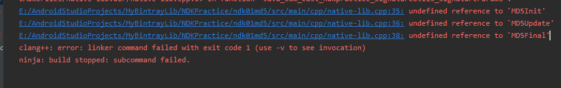

# <center>ndk之md5加密<center>
@[TOC](ndk01_md5加密)

## 踩坑

1. `native-lib.cpp中引入了md5.h`,报错：



`解决`：修改CMakeLists.txt为:

```
add_library( # Sets the name of the library.
             native-lib

             # Sets the library as a shared library.
             SHARED

             # Provides a relative path to your source file(s).
             //将md5.cpp加入到后面，中间使用空格
             native-lib.cpp md5.cpp)
```

2. MD5加密时 `16`位乱码时转`32`位时，应该声明长度为`33`

```
    // 3.MD5加密 C++ 和 java 大同小异,唯一不同的就是C++需要 自己回收内存
    MD5_CTX *ctx = new MD5_CTX();
    MD5Init(ctx);
    MD5Update(ctx, (unsigned char *) signature_str.c_str(), signature_str.length());
    unsigned char digest[16] = {0};
    MD5Final(digest,ctx);

    // 生成 32 位的字符串
    //md5_str[32]md5_str[33]留一位给/0结束符；
    //否则报数组越界。坑。。。。。。。。。。。。。。。。
    char md5_str[33] = {0};
    for(int i = 0; i < 16; i++){
        // 最终生成 32 位 ，不足的前面补0
        sprintf(md5_str,"%s%02x",md5_str,digest[i]);
    }

```

## 主要两个方法

参数md5加密:

```

/**
 *  参数md5加密
 */
extern "C"
JNIEXPORT jstring JNICALL
Java_com_east_ndkpractice_SignatureUtils_params2Md5(JNIEnv *env, jclass clazz,
                                                         jstring params_) {

    if(!verify){
        return env->NewStringUTF("error signature");
    }

    const char *params = env ->GetStringUTFChars(params_,0);

    //MD5签名 根据自己项目的需要制定规则
    // 1.字符串签名加上前缀
    string signature_str(params);
    signature_str.insert(0,EXTRA_SIGNATURE);

    // 2.后面去掉2位
    signature_str = signature_str.substr(0,signature_str.length()-2);

    // 3.MD5加密 C++ 和 java 大同小异,唯一不同的就是C++需要 自己回收内存
    MD5_CTX *ctx = new MD5_CTX();
    MD5Init(ctx);
    MD5Update(ctx, (unsigned char *) signature_str.c_str(), signature_str.length());
    unsigned char digest[16] = {0};
    MD5Final(digest,ctx);

    // 生成 32 位的字符串
    //md5_str[32]md5_str[33]留一位给/0结束符；
    //否则报数组越界。坑。。。。。。。。。。。。。。。。
    char md5_str[33] = {0};
    for(int i = 0; i < 16; i++){
        // 最终生成 32 位 ，不足的前面补0
        sprintf(md5_str,"%s%02x",md5_str,digest[i]);
    }

    //释放资源
    env->ReleaseStringUTFChars(params_,params);
    return env->NewStringUTF(md5_str);
}
```

c 调用 java方法查看签名信息比对

```
/**
 *  签名校验
 */
/**
PackageInfo packageInfo = context.getPackageManager().getPackageInfo(context.getPackageName(), PackageManager.GET_SIGNATURES);
Signature[] signatures = packageInfo.signatures;
return signatures[0].toCharsString();
 */

// C调用Java代码
extern "C"
JNIEXPORT void JNICALL
Java_com_east_ndkpractice_SignatureUtils_signatureVerify(JNIEnv *env, jclass clazz,
                                                         jobject context) {

    // 1.获取包名并验证
    // 1.1获取包名
    jclass jclz = env->GetObjectClass(context);
    jmethodID jmid = env->GetMethodID(jclz,"getPackageName","()Ljava/lang/String;");
    jstring j_package_name = (jstring) env->CallObjectMethod(context,jmid);
    // 1.2比对包名是否一直
    const char *c_package_name = env->GetStringUTFChars(j_package_name,NULL);
    if(strcmp(PACKAGE_NAME,c_package_name) != 0){
        return;
    }

    // 2.获取签名并比对
    // 2.1 获取PackageManager
    jmid = env->GetMethodID(jclz,"getPackageManager","()Landroid/content/pm/PackageManager;");
    jobject  package_manager = env -> CallObjectMethod(context,jmid);
    // 2.2 获取PackageInfo
    jclz = env -> GetObjectClass(package_manager);
    jmid = env -> GetMethodID(jclz,"getPackageInfo","(Ljava/lang/String;I)Landroid/content/pm/PackageInfo;");
    jobject  package_info = env -> CallObjectMethod(package_manager,jmid,j_package_name,0x00000040);
    // 2.3 获取signatures 数组
    jclz = env->GetObjectClass(package_info);
    jfieldID jfieldId = env -> GetFieldID(jclz,"signatures","[Landroid/content/pm/Signature;");
    jobjectArray signatures =  (jobjectArray)env -> GetObjectField(package_info,jfieldId);
    // 2.4 获取 signatures[0]
    jobject signature_first = env ->GetObjectArrayElement(signatures,0);
    // 2.5 调用 signatures 的 toCharsString方法
    jclz = env -> GetObjectClass(signature_first);
    jmid = env -> GetMethodID(jclz,"toCharsString","()Ljava/lang/String;");
    jstring j_signature_str = (jstring)env ->CallObjectMethod(signature_first,jmid);

    // 2.6 对比签名是否一致
    const char * c_signature = env -> GetStringUTFChars(j_signature_str,NULL);
    if(strcmp(c_signature,APP_SIGNATURE) == 0){
        __android_log_print(ANDROID_LOG_ERROR,"TAG","签名校验成功 %s",c_signature);
        verify = true;
    }
}
```
