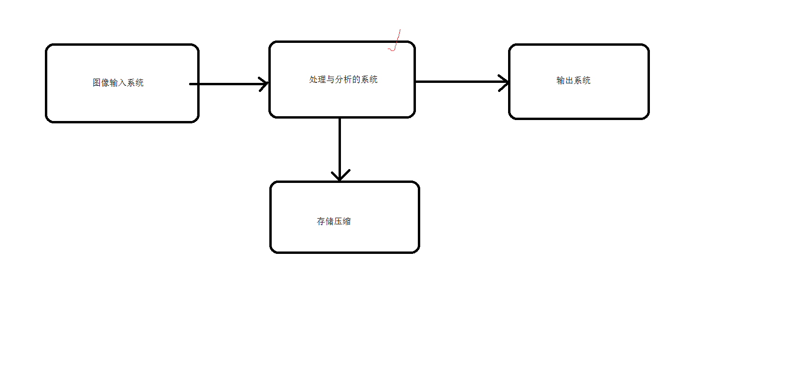
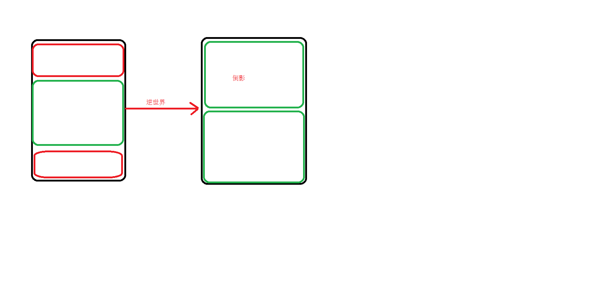

# <center>62.手写QQ说说图片效果<center>

具体代码请看：**[NDKPractice项目的opencv62](https://github.com/EastUp/NDKPractice/tree/master/opencv62)**

# 知识点：

## 1. opencv 的用处

- 提高图片的视觉，图片变换效果
- 提取图像的特征，用来分析
- 图像识别，直播，人脸，指纹，二维码，汽车牌照识别



## 2. Bitmap 的解封装与编解码 

你给一个错误地址，或者给一个文本地址，Glide 是如何判断图片格式，是否错误之类的呢？

`根据流读出来的头几个字节判断格式`。

先说下 `PNG、JPEG、WEBP 区别` :  
`PNG (无损压缩)，JPEG（有损压缩），WEBP  区别？ 有损压缩和无损压缩`

面试中常问问题：`WEBP` 有什么好处？ : 

- `存储空间更小还原度更高`，
-  版本区别：支持 4.0 开始支持，4.2 正式没有问题（alpha颜色通道）


## 3. 逆世界效果

用图片说下原理：



代码：

```c++
Java_com_east_opencv62_NDKBitmapUtils_againstWorld(JNIEnv *env, jclass clazz, jobject bitmap) {
    Mat src;
    cv_helper::bitmap2mat(env, bitmap, src);

    Mat res(src.size(), src.type());
    // 获取图片宽高
    int src_w = src.cols; // 图片的宽
    int src_h = src.rows; // 图片的高
    int mid_h = src_h >> 1; // 逆向世界的一般一般
    int a_h = src_h >> 2; // 原图像的4/1

    // 处理输出图像的下半部分
    for (int row = 0; row < mid_h; ++row) {
        for (int col = 0; col < src_w; ++col) {
            if (src.type() == CV_8UC4)
                res.at<Vec4b>(row + mid_h, col) = src.at<Vec4b>(row + a_h, col);
            else if (src.type() == CV_8UC2)
                res.at<Vec3b>(row + mid_h, col) = src.at<Vec3b>(row + a_h, col);
            else if (src.type() == CV_8UC1)
                res.at<uchar>(row + mid_h, col) = src.at<uchar>(row + a_h, col);
        }
    }

    // 处理输出图像的上半部分
    for (int row = 0; row < mid_h; ++row) {
        for (int col = 0; col < src_w; ++col) {
            if (src.type() == CV_8UC4)
                res.at<Vec4b>(row, col) = src.at<Vec4b>(src_h - row - a_h, col);
            else if (src.type() == CV_8UC2)
                res.at<Vec3b>(row, col) = src.at<Vec3b>(src_h - row - a_h, col);
            else if (src.type() == CV_8UC1)
                res.at<uchar>(row, col) = src.at<uchar>(src_h - row - a_h, col);
        }
    }

    cv_helper::mat2bitmap(env, res, bitmap);
    return bitmap;
}
```

## 4.浮雕效果

```c++
Java_com_east_opencv62_NDKBitmapUtils_anaglyph(JNIEnv *env, jclass clazz, jobject bitmap) {
    // 有立体感，突出了轮廓信息，opencv  卷积
    // [1,0]
    // [0,1]
    Mat src;
    cv_helper::bitmap2mat(env, bitmap, src);
    Mat res(src.size(), src.type());
    // 获取图片宽高
    int src_w = src.cols; // 图片的宽
    int src_h = src.rows; // 图片的高

    for (int row = 0; row < src_h - 1; ++row) {
        for (int col = 0; col < src_w - 1; ++col) {
            if (src.type() == CV_8UC4) {
                Vec4b pixels_p = src.at<Vec4b>(row, col);
                Vec4b pixels_n = src.at<Vec4b>(row + 1, col + 1);
                // bgra
                res.at<Vec4b>(row, col)[0] = saturate_cast<uchar>(pixels_p[0] - pixels_n[0] + 128);
                res.at<Vec4b>(row, col)[1] = saturate_cast<uchar>(pixels_p[1] - pixels_n[1] + 128);
                res.at<Vec4b>(row, col)[2] = saturate_cast<uchar>(pixels_p[2] - pixels_n[2] + 128);
            } else if (src.type() == CV_8UC2) {
                Vec3b pixels_p = src.at<Vec3b>(row, col);
                Vec3b pixels_n = src.at<Vec3b>(row + 1, col + 1);
                // bgr
                res.at<Vec3b>(row, col)[0] = saturate_cast<uchar>(pixels_p[0] - pixels_n[0] + 128);
                res.at<Vec3b>(row, col)[1] = saturate_cast<uchar>(pixels_p[1] - pixels_n[1] + 128);
                res.at<Vec3b>(row, col)[2] = saturate_cast<uchar>(pixels_p[2] - pixels_n[2] + 128);
            } else if (src.type() == CV_8UC1) {
                uchar pixels_p = src.at<uchar>(row, col);
                uchar pixels_n = src.at<uchar>(row + 1, col + 1);
                res.at<uchar>(row, col) = saturate_cast<uchar>(pixels_p - pixels_n + 128);
            }
        }
    }

    cv_helper::mat2bitmap(env, res, bitmap);
    return bitmap;
}
```

## 5.马赛克

```c++
Java_com_east_opencv62_NDKBitmapUtils_mosaic(JNIEnv *env, jclass clazz, jobject bitmap) {
    Mat src;
    cv_helper::bitmap2mat(env, bitmap, src);

    // 获取图片宽高
    int src_w = src.cols; // 图片的宽
    int src_h = src.rows; // 图片的高

    // 省略人脸识别
    int row_start = src_h >> 2;
    int row_end = src_h * 3 / 4;
    int col_start = src_w >> 2;
    int col_end = src_w * 3 / 4;

    int size_h = 50;
    int size_w = 50;

    for (int row = row_start; row < row_end; row += size_h) {
        for (int col = col_start; col < col_end; col += size_w) {
            int pixel = src.at<int>(row, col);
            for (int m_row = 0; m_row < size_w; m_row++) {
                for (int m_col = 0; m_col < size_h; m_col++) {
                    src.at<int>(row + m_row, col + m_col) = pixel;
                }
            }
            // 当还没到结束的区域时，剩下的区域也需要修改像素
            if (col < col_end && col + size_w > col_end) {
                size_w = col_end - col - 1;
            } else {
                size_w = 50;
            }
        }
        // 当还没到结束的区域时，剩下的区域也需要修改像素
        if (row < row_end && row + size_h > row_end) {
            size_h = row_end - row - 1;
        } else {
            size_h = 50;
        }
    }

    cv_helper::mat2bitmap(env, src, bitmap);
    return bitmap;
}
```

## 6.毛玻璃效果 

```c++
Java_com_east_opencv62_NDKBitmapUtils_groundGlass(JNIEnv *env, jclass clazz, jobject bitmap) {
    Mat src;
    cv_helper::bitmap2mat(env, bitmap, src);
    // 不同于高斯模糊，毛玻璃（对某个区域取随机像素）
    // 获取图片宽高
    int src_w = src.cols; // 图片的宽
    int src_h = src.rows; // 图片的高
    int size = 30;

    RNG rng(time(NULL));
    for (int row = 0; row < src_h; ++row) {
        for (int col = 0; col < src_w; ++col) {
            int random = rng.uniform(0, size+1);
            if(row+random >= src_h){
                if(col + random >= src_w){
                    src.at<int>(row, col) = src.at<int>(row - random, col - random);
                }else{
                    src.at<int>(row, col) = src.at<int>(row - random, col + random);
                }
            }else{
                if(col + random >= src_w){
                    src.at<int>(row, col) = src.at<int>(row + random, col - random);
                }else{
                    src.at<int>(row, col) = src.at<int>(row + random, col + random);
                }
            }
        }
    }

    cv_helper::mat2bitmap(env, src, bitmap);
    return bitmap;
}
```

## 7. 油画特效效果

注意：`下面的size 越大效果越明显，但是计算速度越慢`

```c++
Java_com_east_opencv62_NDKBitmapUtils_oilPainting(JNIEnv *env, jclass clazz, jobject bitmap) {
    // 油画基于直方统计
    // 1. 每个点需要分成 n*n 小块
    // 2. 统计灰度等级
    // 3. 选择灰度等级中最多的值
    // 4. 找到所有的像素取平均值

//    1、获取图像的灰度(gray)图片
//    2、设计一个小方框（4x4 or 8x8 or 10x10等），统计每个小方框的像素值
//    3、将0-255的灰度值划分成几个等级，并把第二步处理的结果映射到所设置的各个等级中，并计数
//    4、找到每个方框中灰度等级最多的所有的像素，并且求取这些像素的均值
//    5、用统计出来的平均值来替代原来的像素值

    Mat src;
    cv_helper::bitmap2mat(env, bitmap, src);
    Mat gray;
    cvtColor(src,gray,COLOR_BGRA2GRAY);
    Mat res(src.size(),src.type());

    int src_w = src.cols; // 图片的宽
    int src_h = src.rows; // 图片的高
    int size = 15;
    // 知识不是用来背的 20% ，用来唤醒大家的
    for (int row = 0; row < src_h - size; ++row) {
        for (int col = 0; col < src_w - size; ++col) {
            int g[20] = {0}, b_g[20] = {0}, g_g[20] = {0}, r_g[20] = {0};// 255/8
            // 这个位置  64 循环 -> 1 个像素点 ， 高斯模糊 ，想想怎么优化
            for (int o_rows = 0; o_rows < size; ++o_rows) {
                for (int o_cols = 0; o_cols < size; ++o_cols) {
                    uchar gery = gray.at<uchar>(row + o_rows,col + o_cols);
                    uchar index = gery / (255 / (size - 1)); // 254*7/254
                    g[index] += 1;
                    // 等级的像素之和
                    b_g[index] += src.at<Vec4b>(row + o_rows,col + o_cols)[0];
                    g_g[index] += src.at<Vec4b>(row + o_rows,col + o_cols)[1];
                    r_g[index] += src.at<Vec4b>(row + o_rows,col + o_cols)[2];
                }
            }
            // 最大的角标找出来
            int max_index = 0;
            int max = g[0];
            for (int i = 1; i < size; ++i) {
                if(g[max_index] < g[i]){
                    max_index = i;
                    max = g[i];
                }
            }
            // 会超过 255，超过了的话 会截取最高位
            res.at<Vec4b>(row,col)[0] = b_g[max_index] / max;
            res.at<Vec4b>(row,col)[1] = g_g[max_index] / max;
            res.at<Vec4b>(row,col)[2] = r_g[max_index] / max;
        }
    }
    cv_helper::mat2bitmap(env, res, bitmap);
    return bitmap;
}
```

## 8. 处理速度性能优化

运算速度：位运算 > +- >  */ 。 int > float


